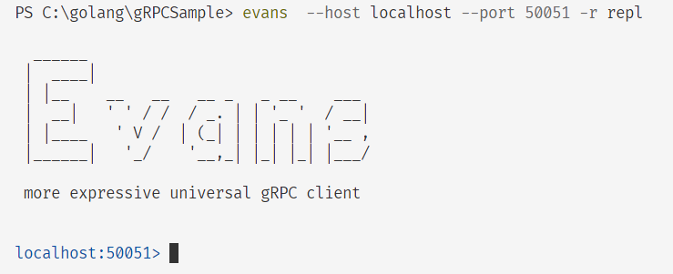

Sample gRPC code being created from following Udemy course
Will be used to add gRPC to bakery project later. No tests becasue this is my learning repo 

## SSL in Windows

You need to run the powershell script ssl.ps1 in folder ssl

This requires openssl.exe application. This exe can be downloaded from https://www.openssl.org/ but it is easier to use the one in your git folder. On this machine it is located in `C:\Program Files\Git\usr\bin` . Ensure that this is in your Environment variables path.
ssl.ps1 is not digitally signed. To force it to run enter `Set-ExecutionPolicy -Scope Process -ExecutionPolicy Bypass` in your powershell application
After running the files generated by openssl will be added to the ssl folder

## evans cli

evans cli uses reflection to act as a gRPC client. You can call server endpoints from the command line and get more information about the available endpoints. Think command line swagger 😎 for gRPC

To install on Windows. Go to https://github.com/ktr0731/evans and click on releases.Select the correct Windows release for your machine. It has a 'gz' extension
Download the file and extract the exe with command `tar -zxvf [archive_name.tar.gz]` eg `tar -zxvf evans_windows_amd64.tar.gz`
This will extract evans.exe to the same folder
Add the extraction folder to your environment path
run the exe. You should be prompted to use options with the command

The certificate we are using is not signed so we need to set consts.UseSSL to false to play with evans.

1. Start the server
2. In another terminal window, run command `evans --host localhost --port 7777 -r repl`
3. You should see:

if it is working
4. Evans will show a pseudo prompt. Checkout the evans repo for available commands
5. If it is a client stream input the ctrl+d will complete the request
5. Ctrl+c will exit evans

## Postman
 Postman can be used to send grpc requests. See this [link](https://blog.postman.com/postman-now-supports-grpc/)
